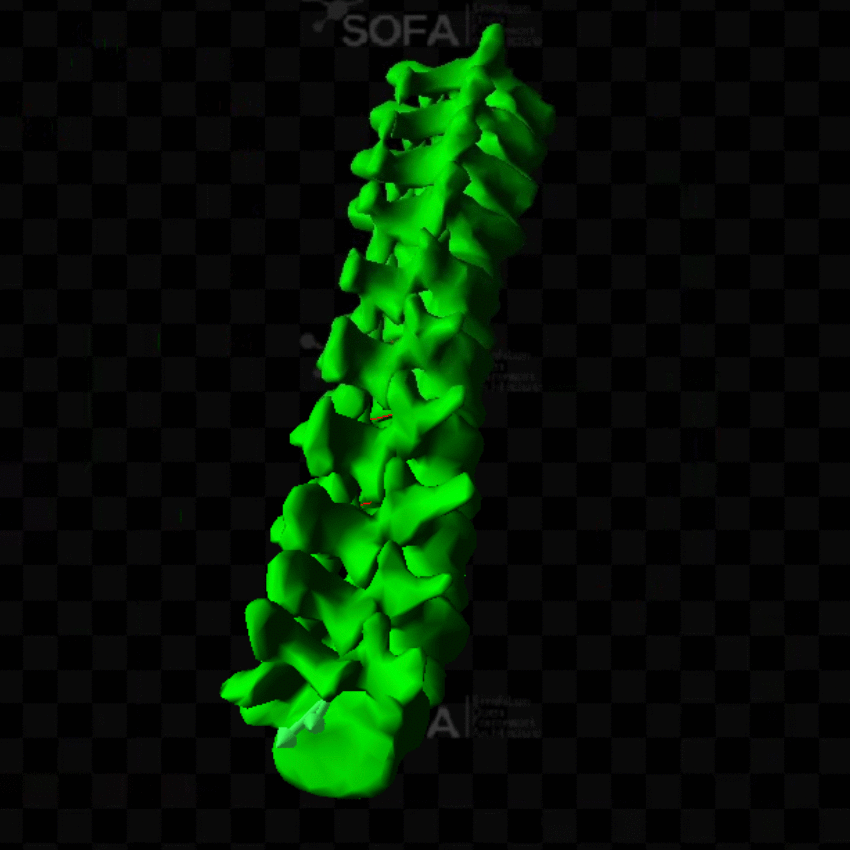

# Spinal_Registration
This repo presents the main results of my research work at the brigham womens hospital as a tranee under the supervision of Nazim Haouchine.

# Data generation:
My training data is a 3d spine deformed using a random force vector.
The simulation is done using SOFA Framework.
I generate sofa files and run them using this python script

# Machine learning training:
For the training I use pytorch and train on a voxelized version of the mesh.
I tried directly training on the mesh using graph neural network but i didnt suceed.

## here is how to train the model

## here is how to use it for validation:

# Results:

## Visual result

On this animation we can see in green the spine simulated with the ground truth force.
The red one is the same spine but simulated using the predicted force.
As you can see the end result is visualy quite close.

## Numeric results
