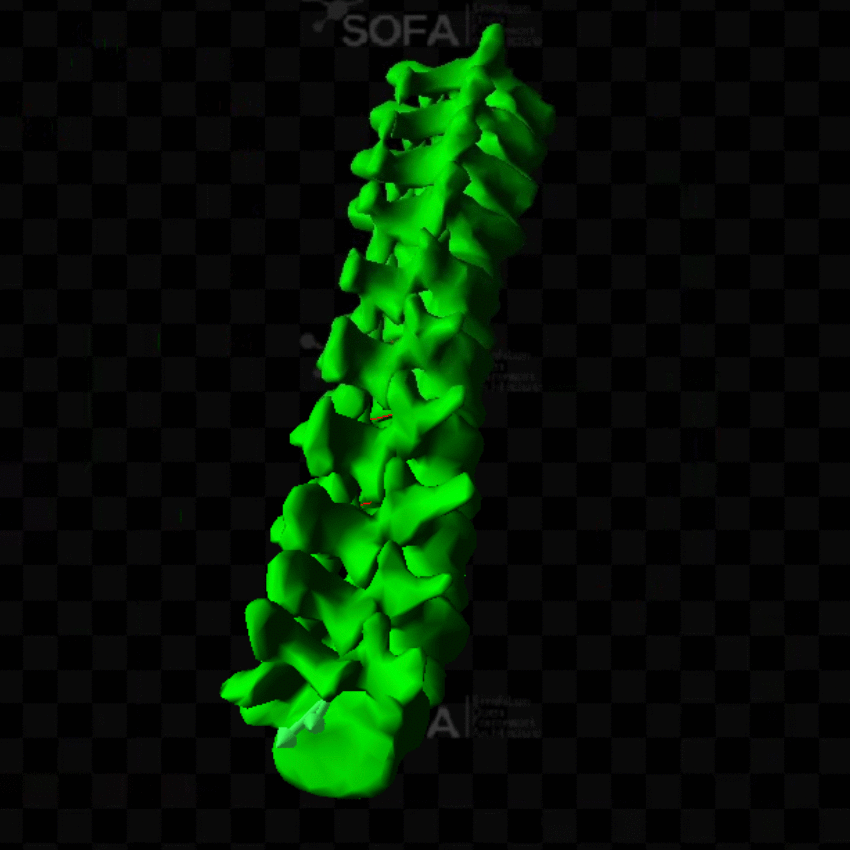

# Spinal_Registration
This repo presents the main results of my research work at the brigham womens hospital as a tranee under the supervision of Nazim Haouchine.

# Usage
In order to use the content of this repo you must install the required dependencies.
You can install SOFA from: [https://www.sofa-framework.org/download/](https://www.sofa-framework.org/download/)

create a python virtual environement and install the requirements with pip: ```pip install -r requirements.txt```

# Data generation:
My training data is a 3d spine deformed using a random force vector.
The simulation is done using SOFA Framework.
I generate sofa files and run them using this python script

```src/DataGeneration/GenerateTrainingData2.py```
at the end of script you can change these parameters
```py
voxel_size = 0.005  # Define an appropriate voxel size
origin = [-.5, -.5, -.1] # origin of voxel box (from corner)
boxlength = 1 # the size of the bounding box(cube) from origin in each direction

mesh_dir = "assets/3D_models/transformed_models_decimated/"
# number of simulations to do
simNumb = 400

# the directory to save the data
dir = r"/.../testing_data" # or r"/.../training_data"

```


# Machine learning training:
For the training I use pytorch and train on a voxelized version of the mesh.
I tried directly training on the mesh using graph neural network but i didnt suceed.

## here is how to train the model


## here is how to use it for validation:


# Results:

## Visual result

On this animation we can see in green the spine simulated with the ground truth force.
The red one is the same spine but simulated using the predicted force.
As you can see the end result is visualy quite close.

## Numeric results
